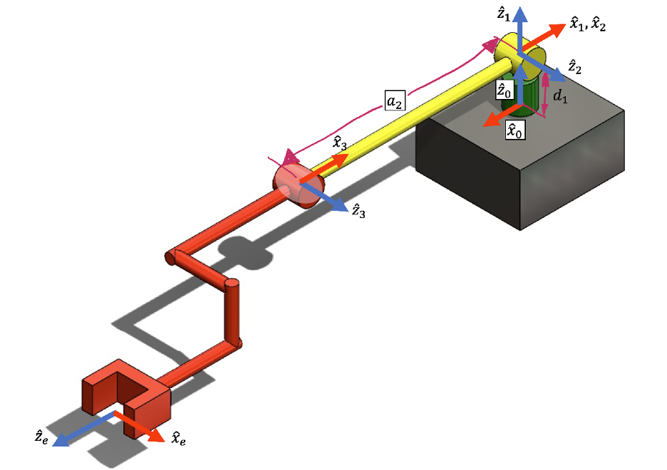
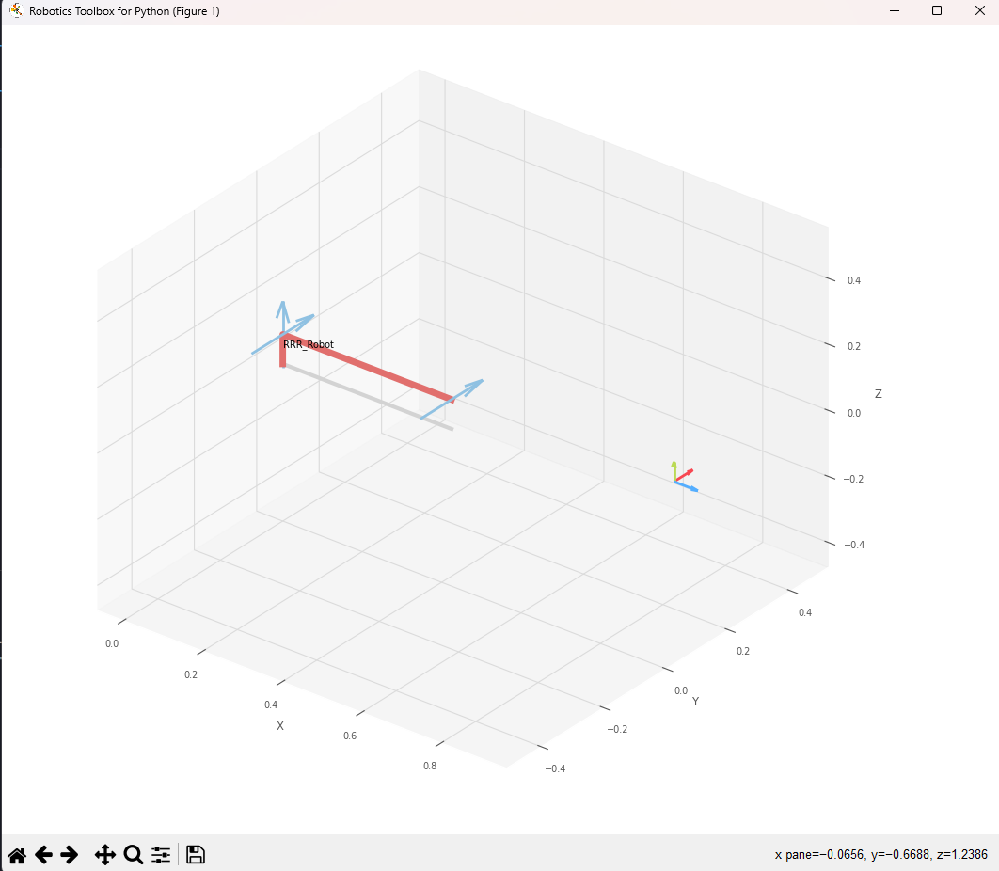
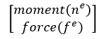

# FRA333 Homework Assignment 3: Static Force

- Keerati Ubonmarl_6503
- Janyawat Saingam_6506



### Objective :
การบ้านนี้ถูกออกแบบึ้นมาเพื่อให้ผู้เรียนได้ประยุกต์ใช้องค์ความรู้การหาจลนศาสตร์เชิงอนุพันธ์ (Differential kinematics) ของหุ่นยนต์แขนกล 3 แกน (3-DOF Manipulator)

### Create RRR Robot :
นำความรู้ในเรื่องของการหาจลศาสตร์เชิงอนุพันธ์มาเพื่อคสบคุมหุ่นยนต์ RRR โดยเริ่มจากการสร้าง MDH Parameter ของหุ่นยนต์ RR ก่อนดังนี้

```python
import roboticstoolbox as rtb
import numpy as np
from spatialmath import SE3
from math import pi,atan2
import random

d_1 = 0.0892
a_2 = -0.425
a_3 = -0.39243
d_4 = 0.109
d_5 = 0.093
d_6 = 0.082

q = [0,0,0]
w = [1.0, 0.0, 1.0, 0.0, 1.0, 0.0]

robot = rtb.DHRobot(
[
    rtb.RevoluteMDH(alpha = 0.0     ,a = 0.0      ,d = d_1      ,offset = pi),
    rtb.RevoluteMDH(alpha = pi/2    ,a = 0.0      ,d = 0.0      ,offset = 0.0),
    rtb.RevoluteMDH(alpha = 0.0     ,a = a_2      ,d = 0.0      ,offset = 0.0)
],
tool = SE3([
    [0 , 0 , -1 , (a_3 - d_6)  ],
    [0 , 1 , 0 ,      -d_5     ],
    [1 , 0 , 0 ,       d_4     ],
    [0 , 0 , 0 ,        1      ]]),

name = "RRR_Robot"
)
```

จะได้ผลลัพธ์ดังนี้
```bash
┌────────┬───────┬────────────┬────────┐
│  aⱼ₋₁  │ ⍺ⱼ₋₁  │     θⱼ     │   dⱼ   │
├────────┼───────┼────────────┼────────┤
│    0.0 │  0.0° │  q1 + 180° │ 0.0892 │
│    0.0 │ 90.0° │         q2 │    0.0 │
│ -0.425 │  0.0° │         q3 │    0.0 │
└────────┴───────┴────────────┴────────┘

┌──────┬─────────────────────────────────────────────────┐
│ tool │ t = -0.47, -0.093, 0.11; rpy/xyz = 0°, -90°, 0° │
└──────┴─────────────────────────────────────────────────┘
```

และได้ home pose ของหุ่นยนต์เมื่อ Q = [0 , 0 ,0] ดังนี้



### โจทย์ข้อที่ 1
จงเขียนฟังก์ชั่นในการ Jacobian ของหุ่นยนต์ตัวนี้ให้อยู่ในฟังก์ชั่นต่อไปนี้
สร้าง function ที่สามารถรับค่า q และนำมาคำนวณหา jacobian ของหุ่นยนต์ได้
โดย function นี้จะทำการเรียกใช้ function  FKHW3 ที่ return Rotation matrix ,Position matrix ,Rotation ที่ end-effector ,Position ที่ end-effector นำมาคำนวณจากสมการ

$$J_{0_{(6x3)}} = \begin{bmatrix}
J_{linear_{(3x3)}} \\
J_{angular_{(3x3)}}
\end{bmatrix} \\ $$

โดยที่

$$ J_{linear,i} = \hat{Z_i} \times (P_{e}^0 - P_i^0)  \\ $$
$$J_{angular,i} = \hat{Z_i} \\ $$

Jacobian จาก Base fram แต่เราต้องการ Jacobian จาก end-effector ดังนั้นสามารถหาได้นี้

$$J_{e_{(6x3)}} = 
J_{0_{(6x3)}}R_e \\ $$

```python
def endEffectorJacobianHW3(q:list[float])->list[float]:
    R,P,R_e,P_e = FKHW3(q)
    J_0 = np.zeros((6, len(q))) # Create jacobian at 0 matrix
    J_e = np.zeros((6, len(q))) # Create jacobian at end-effector matrix
    
    for i in range(len(q)):
        R_z_i = R[:,2,i] # J_0angular[i]
        P_i = P[:,i] # Position 
        
        J_0[ :3, i] = np.cross(R_z_i , (P_e - P_i)) # J_0 and linear
        J_0[ 3:6 , i] = R_z_i # J_0 add angular
        
        J_e[ :3, i] = np.cross(R_z_i , (P_e - P_i)) @ R_e # J_e and linear
        J_e[ 3:6 , i] = R_z_i @ R_e # J_e add angular
        
    return J_0 , J_e
```
### ตรวจคำตอบข้อที่ 1
ใช้วิธีการตรวจคำตอบโดยใช้คำสั่งจาก robotics toolbox และเปรียบเทียบกับค่าจาก fuction endEffectorJacobianHW3(q) โดยใช้ค่า q เดียวกันและปรื้นค่าออกมาด้วยคำสั่งนี้
* (ทำการปัดทษนิยมให้มีแค่ 6 ตำแหน่งเพื่อให้ง่ายต่อการตรวจสอบเนื่องจากทั้ง 2 วิธีได้ค่าที่ความบละเอียดต่างกัน)
```python
import numpy as np

jacobian_robot_toolbox_rounded = np.round(robot.jacobe(q), 6)
jacobian_my_equation_rounded = np.round(endEffectorJacobianHW3(q)[1], 6)

with np.printoptions(precision=6, suppress=True, floatmode='fixed'):
    print("1) Test = ")
    print("jacobian from robotics toolbox")
    print(jacobian_robot_toolbox_rounded)
    print("jacobian from my equation")
    print(jacobian_my_equation_rounded)
    print("-----------------------------------------------")
```

จะได้ผลลัพธ์ดังนี้
```bash
1) Test = 
jacobian from robotics toolbox
[[ 0.899430  0.000000  0.000000]
 [-0.000000 -0.899430 -0.474430]
 [-0.109000 -0.093000 -0.093000]
 [ 0.000000  1.000000  1.000000]
 [ 1.000000  0.000000  0.000000]
 [ 0.000000  0.000000  0.000000]]
jacobian from my equation
[[ 0.899430 -0.000000 -0.000000]
 [-0.000000 -0.899430 -0.474430]
 [-0.109000 -0.093000 -0.093000]
 [ 0.000000  1.000000  1.000000]
 [ 1.000000 -0.000000 -0.000000]
 [-0.000000  0.000000  0.000000]]
-----------------------------------------------
```
ผลลัพธฺออกมามีค่าที่ตรงกันแสดงให้เห็นได้ว่า fuction endEffectorJacobianHW3 สามารถคำนวนหา Jacobian ได้ถูกค้องซึ่งตรงกับ Jacobian ที่มาจาก robotics toolbox

### โจทย์ข้อที่ 2
จงเขียนฟังก์ชั่นในการหาสภาวะ Singularity
จะทำการเขียน fuction ชื่อ checkSingularityHW3 ที่จะรับค่า q เข้าไปและแสดงผลเป็น 1 เมื่อท่านั้นเกิด singularity กับ 0 เมื่อท่านั้นไม่เกิด singularity
โดยมีการคำนวณหา det ของ Jacobian จาก end-effector ในพจน์ Linear ดังสมการ

$$ singularity = 1 : detJ_{e_{(6x3)}(Linear)} < 0.001\\ $$

ที่ได้จาก funtion endEffectorJacobianHW3(q) ดังนี้

```python
def checkSingularityHW3(q:list[float])->bool:
    J_e = (endEffectorJacobianHW3(q))[1]  # use only the J_e (end-effector Jacobian)
    J_e_linear = J_e[:3 , :] # use only linear to be metrix 3x3
   
    det_J = np.linalg.det(J_e_linear) # find det of J_e_linear
    if det_J < 0.001:
        singularity = 1 # that q is singularity
    else:
        singularity = 0 # that q isn't singularity
        
    return singularity # singularity state
```

### ตรวจคำตอบข้อที่ 2
จะตรวจคำตอบจากการสุ่มตำแหน่งเชิงมุม q ของหุ่นยนต์เพื่อนำมาเข้าสู่ fuction เพื่อเปรียบเทียบระหว่างการตรวจสอบด้วย Jacobian ที่ได้จาก Robotics toolbox กับ จาก fuction endEffectorJacobianHW3 และนำมาหา det ของ Jacobian ในพจน์ Linear ว่าได้ singularity ที่ตรงกันรึปล่าวตามสมการ

$$ singularity = 1 : detJ_{e_{(6x3)}(Linear)} < 0.001\\ $$


```python
q1 = float(random.uniform(-pi, pi))
q2 = float(random.uniform(-pi, pi))
q3 = float(random.uniform(-pi, pi))
q = [q1, q2, q3]

det_J = np.linalg.det(robot.jacobe(q)[:3 , :]) # find det of Jacobian end-effector from RTB at only 3x matrix
if det_J < 0.001:
    singularity = 1 # that q is singularity
else:
    singularity = 0 # that q isn't singularity

print("2) Test = ")
print("random q")
print(q)
print("check singularity state from RTB")
print(singularity)
print("return singularity state from my function")
print(checkSingularityHW3(q))
print("-----------------------------------------------")
```
ได้ผลลัพธ์ดังนี้
- ตัวอย่างผลลัพธ์เมื่อไม่เกิด singilarity
```text
2) Test =
random q
[-0.1518221968165676, 0.4020985616151269, 1.8388676644564557]
check singularity state from RTB
0
return singularity state from my function
0
-----------------------------------------------
```
- ตัวอย่างผลลัพธ์เมื่อเกิด singilarity
```text
2) Test = 
random q
[0.6271823479018752, 3.044953132267154, -0.09289445455943568]
check singularity state from RTB
1
return singularity state from my function
1
-----------------------------------------------
```
### โจทย์ข้อที่ 3
จงเขียนฟังก์ชั่นในการหาeffortของแต่ละข้อต่อเมื่อมี wrench มากระทำกับจุดกึ่งกลางของเฟรมพิกัด F_e

<p align="center">
    
</p>

ทำการสร้าง function computeEffortHW3(q,w) ที่จะรับค่าตำแหน่งเชิงมุม q ของหุ่นและแรงกระทำภายนอกในทุกด้านทุกมุม w และคำนวณออกมาเป็น τ
โดยคำนวณจากสมการดังนี้

$$ τ = J_{e(\text{Linear})}^{T}w\\ $$

โดยที่

$$
w = \left[ \text{force}_x, \ \text{force}_y, \ \text{force}_z, \ \text{textmoment}_x, \ \text{moment}_y, \ \text{moment}_z \right]
$$

สามารถเขียนใน function ได้ดังนี้
```python
def computeEffortHW3(q:list[float], w:list[float])->list[float]:
    J_e = (endEffectorJacobianHW3(q))[1] # use only the J_e (end-effector Jacobian)
    J_Trans = np.transpose(J_e) # Transpose jacobian matrix
    
    tau = J_Trans @ w # J_Transpose cross to wrench
    return tau
```

### ตรวจคำตอบข้อที่ 3
สามารถตรวจคำตอบของ τ โดยทำการสุ่มค่า w โดยกำหนดให้แรงมีค่าตั้งแต่ 0-10 แลพทำการหา τ โดยใช้คำสั่งจาก Robotics toolbox และเปรัยบเทียบกับ τ ที่ได้จาก computeEffortHW3 ดังนี้
* (ทำการปัดทษนิยมให้มีแค่ 6 ตำแหน่งเพื่อให้ง่ายต่อการตรวจสอบเนื่องจากทั้ง 2 วิธีได้ค่าที่ความบละเอียดต่างกัน)
```python
w = [random.uniform(0, 10) for _ in range(6)]

J_e = robot.jacobe(q)
effort_robotics_toolbox = np.round(robot.pay(w, q, J_e), 6)
effort_my_equation = np.round(computeEffortHW3(q, w), 6)

with np.printoptions(precision=6, suppress=True, floatmode='fixed'):

    print("3) Test = ")
    print("random w")
    print(w)
    print("Tau form robotics_toolbox")
    print(effort_robotics_toolbox)  # force from robot
    print("Tau form my equation")
    print(effort_my_equation)  # force from external force
    print("effort_robotics_toolbox + effort_my_equation = ")
    print(effort_robotics_toolbox + effort_my_equation)
    print("-----------------------------------------------")
```

ผลลัพธ์ที่ได้
```text
3) Test =
random w
[5.859369746768605, 5.436879593433474, 2.673125330646168, 8.461259734146893, 6.823918388490622, 3.488454961377825]
Tau form robotics_toolbox
[-7.837535 -7.276078 -5.633240]
Tau form my equation
[7.837535 7.276078 5.633240]
effort_robotics_toolbox + effort_my_equation =
[0.000000 0.000000 0.000000]
-----------------------------------------------
```

แสดงให้เห็นว่าค่า τ ที่ได้จาก RTB และจาก function computeEffortHW3 นั้นเป้นแรงคู่ปฏิกริยากันนั่นคือแรงกระทำภายนอกเข้ามากระทำกับหุ่นและแรงที่หุ่นต้องออกเพื่อคงตำแหน่งไม่ให้ขยับไปตามแรงหรือเป็น static นั้นมี amplitude เท่ากัน แรงกระทำจึงรวมกันได้เป็น 0 ในแต่ละแกนนั่นเอง
